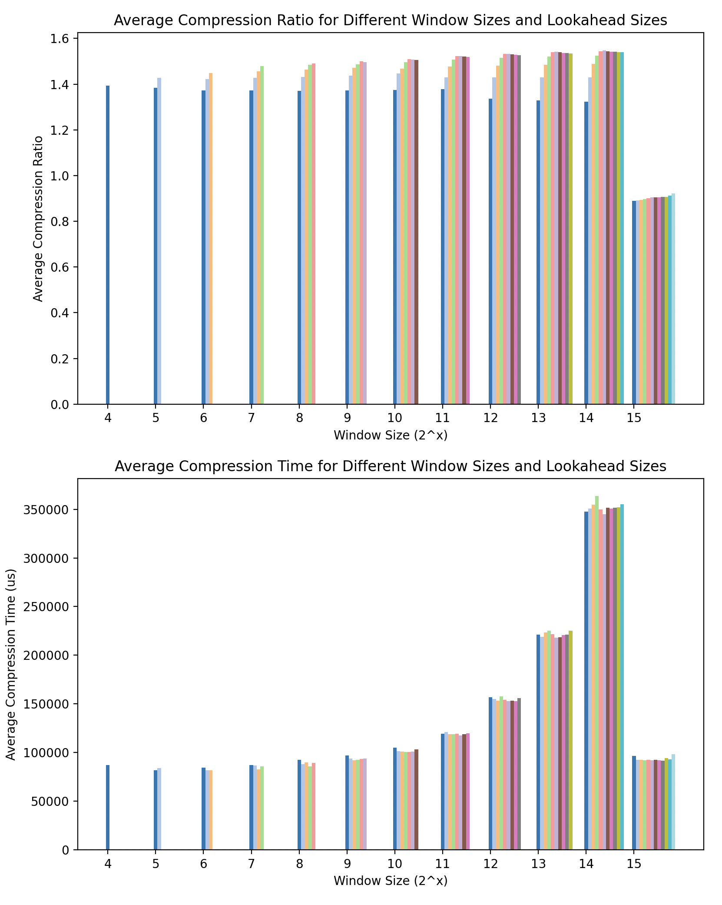

[](https://crates.io/crates/embedded-heatshrink)


# Embedded Heatshrink

This library is a rewrite/port of the C library [heatshrink](https://github.com/atomicobject/heatshrink). It has the same sink/poll API as the original library, but it is written in Rust. It is faster because of some optimizations for pushing bits and array manipulation. It fixes some bugs found during fuzzing.

## Key Features

* Low memory usage (as low as 50 bytes) It is useful for some cases with less than 50 bytes, and useful for many general cases with < 300 bytes.
* Incremental, bounded CPU use You can chew on input data in arbitrarily tiny bites. This is a useful property in hard real-time environments.

## Usage

This is an example pulled from the library that uses the streaming API to one-shot compress. If you want to stream continuously, then you reuse the same `HeatshrinkEncoder` instance. The `HeatshrinkDecoder` is the same.

```rust
#[inline]
fn read_in(stdin: &mut impl Read, buf: &mut [u8]) -> usize {
    stdin.read(buf).expect("Failed to read from stdin")
}

#[inline]
fn write_out(stdout: &mut impl Write, data: &[u8]) {
    stdout.write_all(data).expect("Failed to write to stdout");
}

pub fn encode(window_sz2: u8, lookahead_sz2: u8, stdin: &mut impl Read, stdout: &mut impl Write) {
    let mut encoder = HeatshrinkEncoder::new(window_sz2, lookahead_sz2)
        .expect("Failed to create encoder");

    const WORK_SIZE_UNIT: usize = 1024; // Aritrary size, just > 0
    let mut buf = [0; WORK_SIZE_UNIT];
    let mut scratch = [0; WORK_SIZE_UNIT * 2];

    // Sink all bytes from the input buffer
    let mut not_empty = false;
    loop {
        let read_len = read_in(stdin, &mut buf);
        not_empty |= read_len > 0;
        if read_len == 0 {
            break;
        }
        let mut read_data = &buf[..read_len];
        while !read_data.is_empty() {
            let sink_res = encoder.sink(read_data);
            match sink_res {
                HSESinkRes::Ok(bytes_sunk) => {
                    read_data = &read_data[bytes_sunk..];
                }
                _ => unreachable!(),
            }

            loop {
                match encoder.poll(&mut scratch) {
                    HSEPollRes::Empty(sz) => {
                        write_out(stdout, &scratch[..sz]);
                        break;
                    }
                    HSEPollRes::More(sz) => {
                        write_out(stdout, &scratch[..sz]);
                    }
                    HSEPollRes::ErrorMisuse | HSEPollRes::ErrorNull => unreachable!(),
                }
            }
        }
    }

    if !not_empty {
        return;
    }

    // Poll out the remaining bytes
    loop {
        match encoder.finish() {
            HSEFinishRes::Done => {
                break;
            }
            HSEFinishRes::More => {}
            HSEFinishRes::ErrorNull => unreachable!(),
        }

        loop {
            match encoder.poll(&mut scratch) {
                HSEPollRes::Empty(sz) => {
                    write_out(stdout, &scratch[..sz]);
                    break;
                }
                HSEPollRes::More(sz) => {
                    write_out(stdout, &scratch[..sz]);
                }
                HSEPollRes::ErrorMisuse | HSEPollRes::ErrorNull => unreachable!(),
            }
        }
    }
}
```

## Compression Performance

The window_sz2 (`window_size = 1 << window_size2`) controls the lookback and lookahead buffer sizes. It dominates the allocation size and cpu usage. The lookahead_sz2 (`lookahead_size = 1 << lookahead_size2`) controls the maximum length of a match. The sum of window_sz2 and lookahead_sz2 determines the bits used to replace a match, so higher lookahead_sz2 doesn't always mean better compression.

For memory allocation, here are some practical values chosen for sensor data that was delta compressed:
```rust
const HEATSHRINK_WINDOW_SZ2: u8 = 11; // dramatically affects both heap and cpu usage
const HEATSHRINK_LOOKAHEAD_SZ2: u8 = 3; // barely affects anything, longer matches are rare in sensor data
const HEATSHRINK_INPUT_BUFFER_SIZE: u16 = 500; // Small enough that we don't fragment the heap, large enough that most payloads fit in one or two chunks
const HEATSHRINK_ALLOCATED_SIZE: usize = (2 << HEATSHRINK_WINDOW_SZ2) + (2 << (HEATSHRINK_WINDOW_SZ2 + 1)); // Input buffer plus search index
```

Over some real-world delta compressed accelerometer data, here are some compression times and ratios plotted with the min of window_sz2=4 and lookahead_sz2=3. lookahead_sz2 is valid from 3 up to window_sz2 - 1. The compression ratio is the ratio of the original size to the compressed size. The compression time is the time to compress the data in microseconds.



## CLI Binary

There is a simple CLI binary. Install it with `cargo install --path . --features std`.

It reads from stdin and writes to stdout. Here is an example:

```sh
hsz < input.txt > output.txt.hs
```

To decompress:

```sh
hsz < output.txt.hs > output.txt
```

Roundtrip:
```sh
hsz < input.txt | hsz -d > output.txt
diff input.txt output.txt
```

## Benchmarks

hsz isn't the best; it is compromise based on LVSS. It does fairly well on data that has repetitions but not so well on compressed data (like pngs). Here are some results from `./bench.sh`:


| Tool   | File                               | Avg. Compression Ratio | Avg. Compression Time | Avg. Decompression Time |
|--------|------------------------------------|------------------------|-----------------------|-------------------------|
| gzip   | tsz-compressed-data.bin            | 0.55                   | 0.042 seconds         | 0 seconds               |
| bzip2  | tsz-compressed-data.bin            | 0.55                   | 0.224 seconds         | 0.056 seconds           |
| xz     | tsz-compressed-data.bin            | 0.55                   | 0.206 seconds         | 0.050 seconds           |
| zstd   | tsz-compressed-data.bin            | 0.55                   | 0 seconds             | 0.002 seconds           |
| hsz    | tsz-compressed-data.bin            | 0.66                   | 0.038 seconds         | 0.010 seconds           |
| gzip   | fuzz/index.html                    | 0.10                   | 0.010 seconds         | 0 seconds               |
| bzip2  | fuzz/index.html                    | 0.05                   | 0.070 seconds         | 0.010 seconds           |
| xz     | fuzz/index.html                    | 0.06                   | 0.136 seconds         | 0 seconds               |
| zstd   | fuzz/index.html                    | 0.08                   | 0 seconds             | 0 seconds               |
| hsz    | fuzz/index.html                    | 0.20                   | 0.010 seconds         | 0 seconds               |
| gzip   | average-compression-tsz-data.png   | 0.92                   | 0.040 seconds         | 0 seconds               |
| bzip2  | average-compression-tsz-data.png   | 0.94                   | 0.154 seconds         | 0.080 seconds           |
| xz     | average-compression-tsz-data.png   | 0.88                   | 0.260 seconds         | 0.080 seconds           |
| zstd   | average-compression-tsz-data.png   | 0.93                   | 0.006 seconds         | 0 seconds               |
| hsz    | average-compression-tsz-data.png   | 1.05                   | 0.040 seconds         | 0.020 seconds           |


## Testing and Fuzzing

The tests take forever to run, but they are long because the original library worked very close to the maximum range of u16. The tests compiled several small files with many permutations of valid configurations.

The fuzzing is split into two options:

1. `./fuzz.sh 1000000` - This will generate some files with `dd` and roundtrip compress/decompress them with the binary
